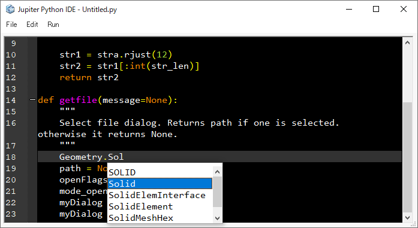
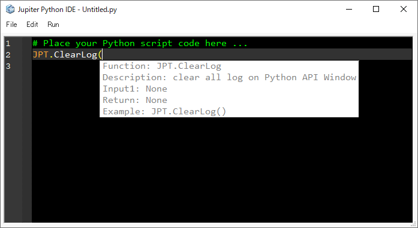
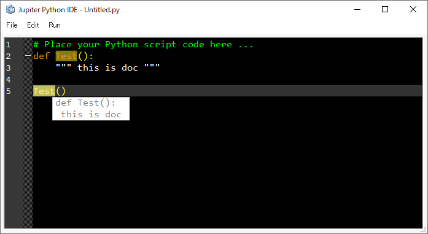
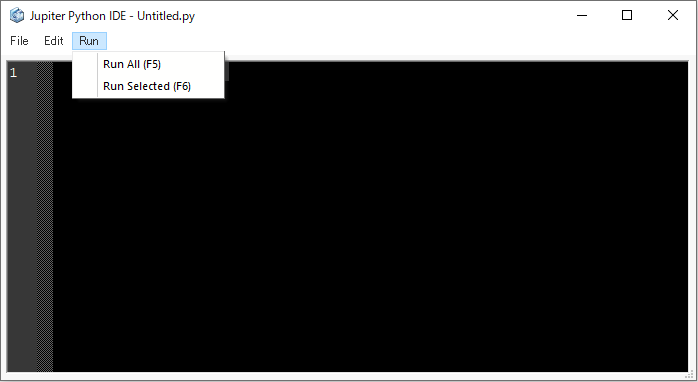
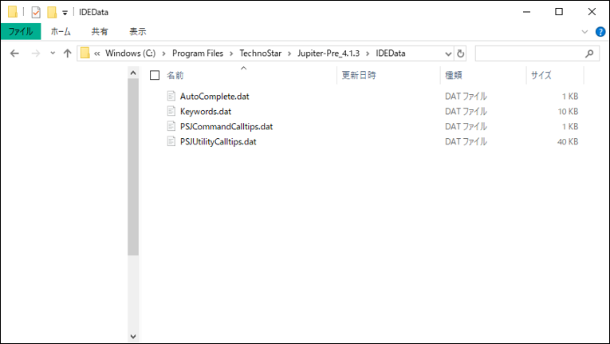

# IDE

This section will introduce Jupiter's customized [IDE](https://en.wikipedia.org/wiki/Integrated_development_environment) for {doc}`PSJ <index>`.

## Character input

### Highlight

When user double-clicks a word, the same word is highlighted (yellow).  
The highlighted data is stored in the database folder.

### Auto completion

Supports auto-completion. For example, if user types "Geometry.Sol"", a list box will appear and show words that start with "Sol".  
The auto-completion data is stored in the database folder.

This function supports the following:

- All words in the IDE
- Python keywords
- PSJ-Utility

### Tooltip

Supports tooltips. For example, if user enters "JPT.ClearLog(", a tooltip showing the JPT.ClearLog document is displayed.  
Tooltip data is stored in the database folder.

### User-defined function tooltip

It also supports user functions.

## File Menu

| Name    | Description                                   | Shortcut key                                                           |
| ------- | --------------------------------------------- | ---------------------------------------------------------------------- |
| New     | Make a new document                           | {badge}`Ctrl,badge-dark badge-pill` + {badge}`N,badge-dark badge-pill` |
| Open    | Open a saved Python script file               | {badge}`Ctrl,badge-dark badge-pill` + {badge}`O,badge-dark badge-pill` |
| Save    | Save the Python script file                   | {badge}`Ctrl,badge-dark badge-pill` + {badge}`S,badge-dark badge-pill` |
| Save As | Save the Python script file with another name | {badge}`Ctrl,badge-dark badge-pill` + {badge}`E,badge-dark badge-pill` |
| Exit    | Close the IDE                                 | {badge}`Ctrl,badge-dark badge-pill` + {badge}`Q,badge-dark badge-pill` |

## Edit Menu

| Name                        | Description                                                                     |                              Shortcut key                              |
| --------------------------- | ------------------------------------------------------------------------------- | :--------------------------------------------------------------------: |
| Undo                        | Cancel the executed operation and return to the previous state                  | {badge}`Ctrl,badge-dark badge-pill` + {badge}`Z,badge-dark badge-pill` |
| Redo                        | Retry the canceled operation                                                    | {badge}`Ctrl,badge-dark badge-pill` + {badge}`Y,badge-dark badge-pill` |
| Cut                         | Cut the selected text                                                           | {badge}`Ctrl,badge-dark badge-pill` + {badge}`X,badge-dark badge-pill` |
| Copy                        | Copy the selected text                                                          | {badge}`Ctrl,badge-dark badge-pill` + {badge}`C,badge-dark badge-pill` |
| Paste                       | Paste the Cut/Copy text                                                         | {badge}`Ctrl,badge-dark badge-pill` + {badge}`V,badge-dark badge-pill` |
| Import Macro Log            | Import the macro of the executed command in the form of JPT.Exec(macro command) | {badge}`Ctrl,badge-dark badge-pill` + {badge}`M,badge-dark badge-pill` |
| Import Python Macro Log     | Import the executed PSJ-Command (only supported in the next version)            | {badge}`Ctrl,badge-dark badge-pill` + {badge}`J,badge-dark badge-pill` |
| Import Script From Last Run | Import the Python script from last run in the IDE                               | {badge}`Ctrl,badge-dark badge-pill` + {badge}`L,badge-dark badge-pill` |
| Find                        | Find a specific character in the script                                         | {badge}`Ctrl,badge-dark badge-pill` + {badge}`F,badge-dark badge-pill` |
| Comment                     | Insert the comment tag "\#" before the selected script                          | {badge}`Ctrl,badge-dark badge-pill` + {badge}`K,badge-dark badge-pill` |
| Toggle Comment              | Switch between comment and comment cancellation                                 | {badge}`Ctrl,badge-dark badge-pill` + {badge}`T,badge-dark badge-pill` |
| Go To Line                  | Go to a specific line in the script                                             | {badge}`Ctrl,badge-dark badge-pill` + {badge}`G,badge-dark badge-pill` |
| Find And Replace            | Find and replace the specific characters in the script                          | {badge}`Ctrl,badge-dark badge-pill` + {badge}`H,badge-dark badge-pill` |

## Run Menu

| Name         | Description                              |           Shortcut key            |
| ------------ | ---------------------------------------- | :-------------------------------: |
| Run All      | Execute all the script                   | {badge}`F5,badge-dark badge-pill` |
| Run Selected | Execute only the current selected script | {badge}`F6,badge-dark badge-pill` |

## Database

The IDE database is stored in the Jupiter installation folder (.../IDEData/).  
This database can be edited freely.

Content of each file

- Keywords.dat: Keywords highlighted in the IDE

- PSJUtilityCalltips.dat: PSJ-Utility predictive conversion and call tips
