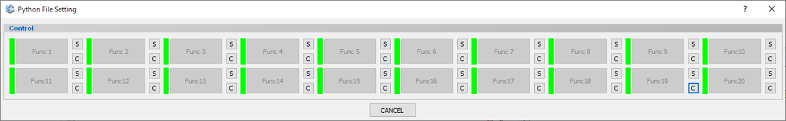
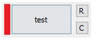

# File Launcher

## Interface

  
  
| Buton | Description                                                 |
|-------|-------------------------------------------------------------|
| {badge}`S,badge-dark badge-pill`     | Register the Python file                                    |
| {badge}`C,badge-dark badge-pill`     | Clear the registered Python file                            |
| {badge}`R,badge-dark badge-pill`     | Replace the registered Python file with another Python file |
| {badge}`Func,badge-dark badge-pill`  | Execute the registered Python program                       |

## Operating procedure

1. Click the S button and select the Python file   
2. When you select a file, the green mark to the left of the Function button turns red   
3. Click the Function button to execute the program   
