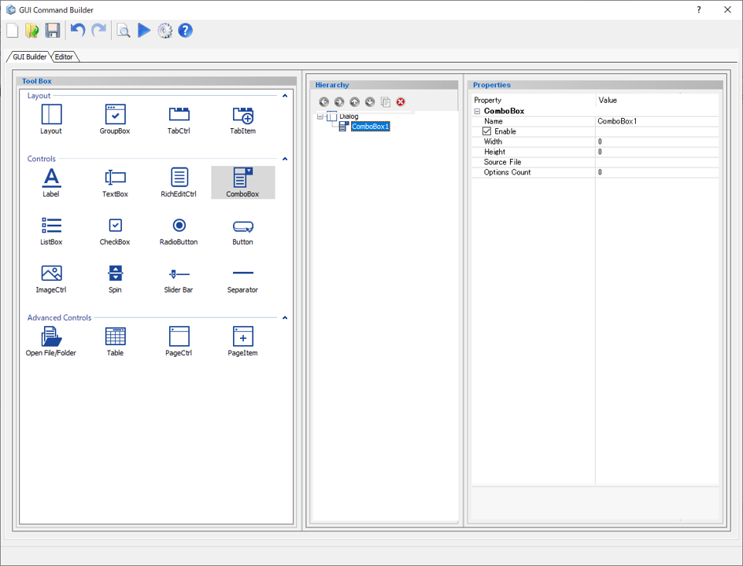
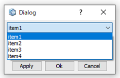
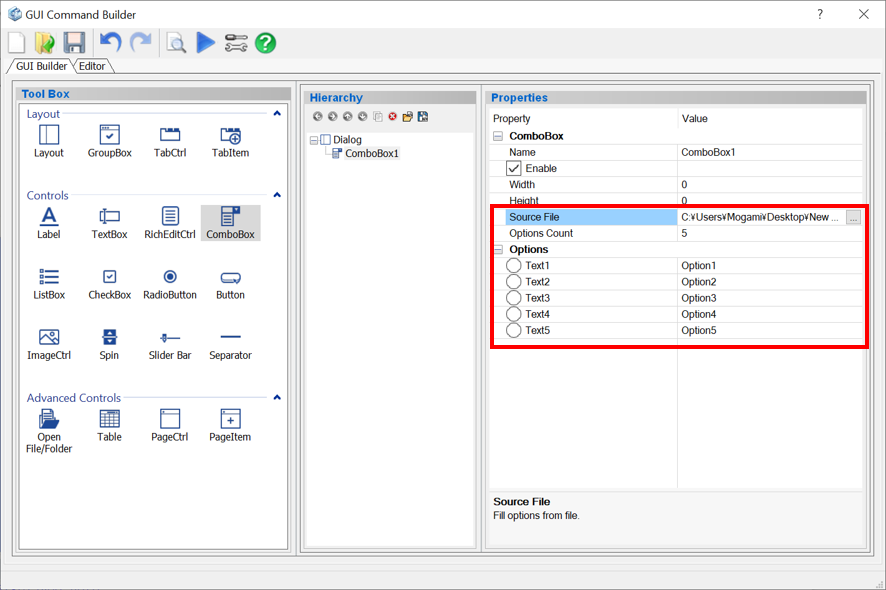

# Combo Box

Create a combo box.  

  
  

Preview dialog:

  

## Parameters

**Name**

Enter the name of the combo box component.

**Enable**

Specify whether to enable it or not.

- **Check On** : Available
- **Check Off** : Unavailable (grayed out)

**Width**

Specifies the minimum width of the combo box. (in pixels)

**Height**

Specifies the minimum height of the combo box.(in pixels)

**Source File**

Import options from a text file.

Structure of the Source File:

 Option1  
 Option2  
 Option3  
 Option4  
 Option5  
  ↓  
 Input result:

  
  

**Options Count**

Specify the number of selection options.

**Options**

Enter the name of the selection in the combo box.

## Command to use

| Command                   | Description                  | Sample Code                  |
| ----------------------------------------------------------- | ------------------------------------------------------------ | ------------------------------------------------------------ |
| dlg.get_combobox_sel("name")          | Get the position of the item selected in the combo box  | ComboBox = ["1", "2", "3", "4", "5"] When "4" is selected *Input:* `a = dlg.get_combobox_sel("ComboBox")` *Output:*  > a = 3 |
| dlg.get_len_combobox("name")          | Get the length (number of selection options) of the combo box  | ComboBox = ["1", "2", "3", "4", "5"] *Input:* `a = dlg.get_len_combobox("ComboBox")` *Output:*  > a = 5 |
| dlg.set_combobox_sel("Name", Index)           | Set the selected option in the combo box  | ComboBox = ["1", "2", "3", "4", "5"] *Input:* `dlg.set_combobox_sel("ComboBox", 3)` *Output:*  Selected value="4"|
| dlg.insert_combobox_option("name", position, "text")           | Add one option to a specific position in the combo box  | *Input:* `dlg.insert_combobox_option("name", 1, "text")`|
| dlg.insert_combobox_options("name", position, [itemlist])           | Add multiple options to a specific position in the combo box  | *Input:* `dlg.insert_combobox_options("name", 3, [Itemlist])`|
