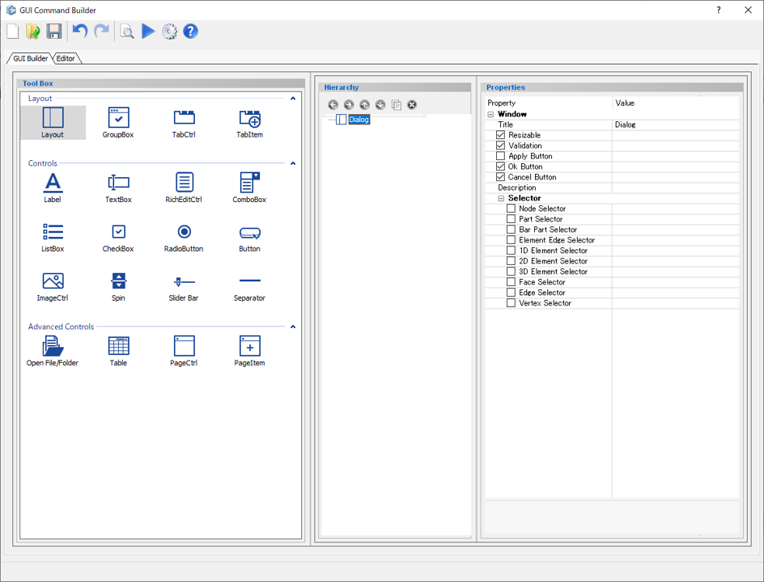

# Dialog

Set the title, execute button, and selection list of the created dialog.

 

Preview dialog

## Parameters

**Title**

Enter the title of the dialog you want to create.

**Resizable**

Specify if the dialog can be resized or not

- **Check On** : The size of the dialog can be adjusted.
- **Check Off** : The size of the dialog is fixed.

**Validation**

Specify if user's inputs in the dialog will be checked for validation
(format, number format, etc.)

- **Check On** : Will be checked for validation
- **Check Off** : Will not be checked for validation

**Apply Button**

Specify if the Apply button will be created or not.

- **Check On** : Created
- **Check Off** : Not created

**Ok Button**

Specify if the OK button will be created or not.

- **Check On** : Created
- **Check Off** : Not created

**Cancel Button**

Specify if the Cancel button will be created or not.

- **Check On** : Created
- **Check Off** : Not created

**Description**

The information entered here will be displayed at the top of the dialog.

**Selector**

Specify selectable types in selection list.

*Supported Selection Types: Node Selector, Part Selector, Bar Part Selector, Element Edge Selector, 1D Element Selector, 2D Element Selector,3D Element Selector,Face Selector, Edge Selector, Vertex Selector*

## Command to use

| Command                   | Description                  | Sample Code                  |
| ----------------------------------------------------------- | ------------------------------------------------------------ | ------------------------------------------------------------ |
| dlg.on_command("name", function)         | Incorporate the execution function to the created component  | *Input:* `dlg.on_command("ButtonOk",on_click_exec_button)`  |
| dlg.add_space(orientation = "horizontal, layout = "Layout") | Add a placeholder with the specified orientation     | *Input:* `dlg.add_space(orientation="horizontal",layout="footer")` |
| dlg.get_selected_entities(int selector_id)      | Get the selected entities for the specified Selector   | *Input:* `dlg.get_selected_entities(0) `         |
| dlg.disable_item("component name")          | Change the property status of a component from enabled to disabled | *Input:* `dlg.disable_item("TextBox")`        |
| dlg.enable_item("component name")         | Change the property status of a component from disabled to enabled. | *Input:* `dlg.enable_item("TextBox")`         |
