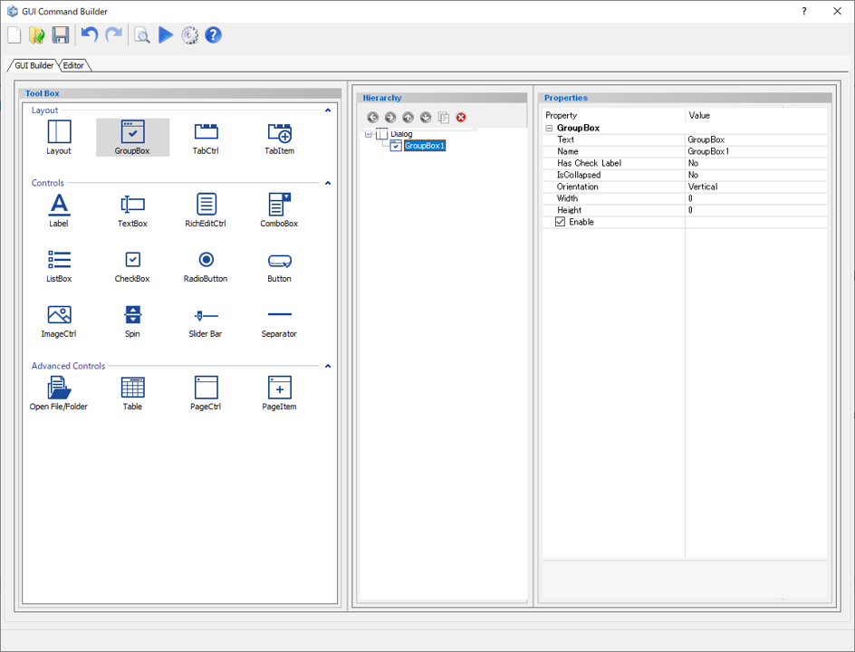
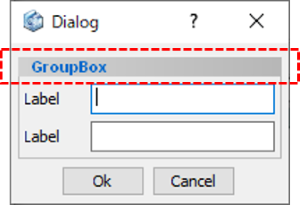

# Group Box

Create a group box which can contain some components.  

  
  
Preview dialog:

  
  
## Parameters

**Text**

   Enter the text appears on the top of the group box.

**Name**

   Enter the name of the group box component.

**Has Check Label**

- **No** : Always make the components inside enable
- **Yes(Default==Checked)** : Display a checked check box on the top right corner (all components inside are available to use)
- **Yes(Default==Unchecked)** : Display an unchecked check box on the top right corner (all components inside are unavailable to use)

**IsCollapsed**

   Set the collapsible display of the group box.

- **No** : Not collapsible
- **Yes(Default==Collapsed)** : The group box is collapsible (Default status: Collapsed)
- **Yes(Default==Expanded)** : The group box is collapsible (Default status: Expanded)

**Orientation**

   Specify the position of components inside.

- **Horizontal** : Arrange the inside components horizontally
- **Vertical** : Arrange the inside components vertically

**Width**

   Specify the minimum width of the group box. (in pixels)

**Height**

   Specify the minimum height of the group box. (in pixels)

**Enable**

   Specify whether to enable it or not.

- **Check On** : Available
- **Check Off** : Unavailable (grayed out)
