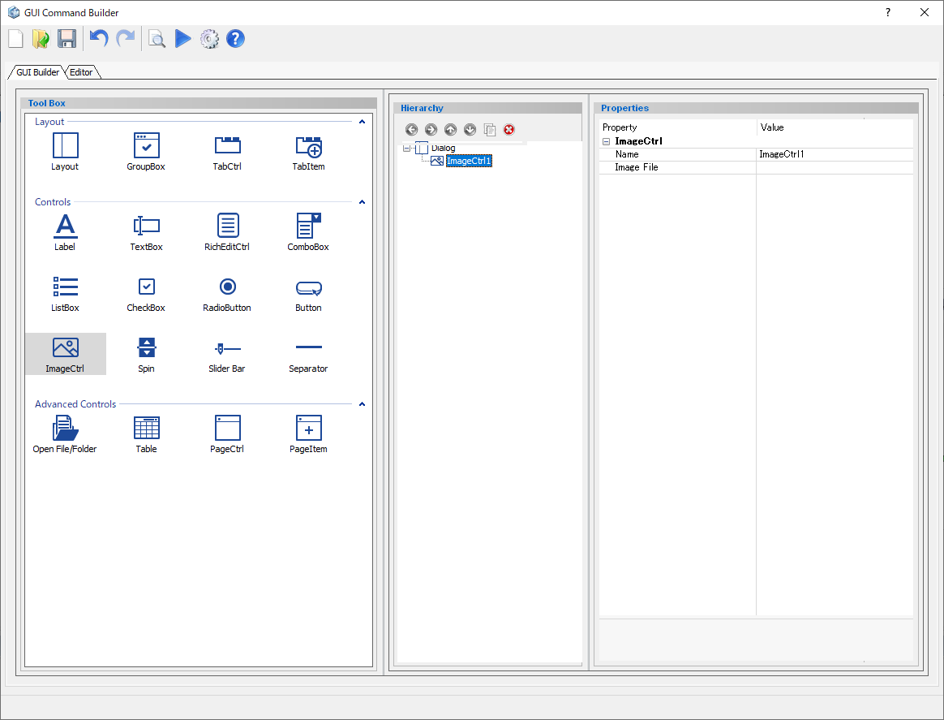
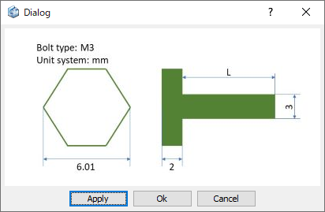

# Image Control

Create an image container.  

  

Preview dialog:

  
  
## Parameters

**Name**

   Enter the name of the image control component.

**Image File**

   Display the link to the image.

## Command to use

| Command                                                     | Description                                                  | Sample Code                                                  |
| ----------------------------------------------------------- | ------------------------------------------------------------ | ------------------------------------------------------------ |
| dlg.set_image_file("name", "link")                         | Set the location to the image file  | *Input:* `dlg.set_image_file("ImageCtrl", "C:/Users/M3.JPG")`    |
