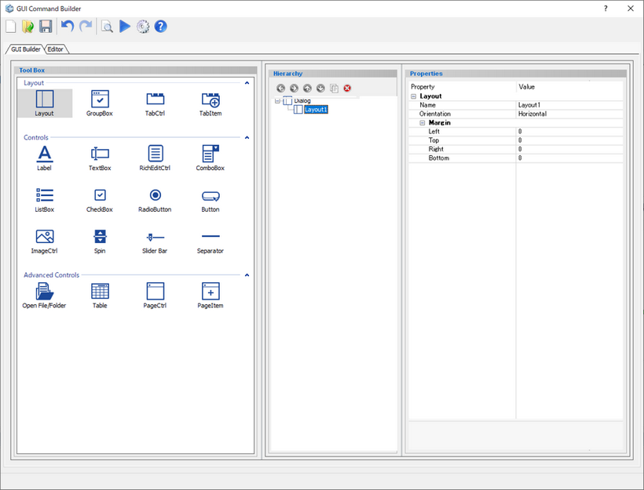
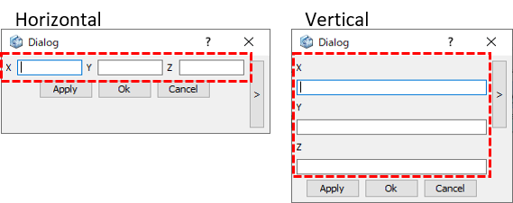

# Layout

Create a layout to arrange components inside.  

  
  
Preview dialog:

## Parameters

**Name**

Enter the name of the layout component.

**Orientation**

Specify the position of components inside.

- **Horizontal** : Arrange the inside components horizontally
- **Vertical** : Arrange the inside components vertically

**Margin**

**Left** : Put a margin to the left of the Group Box. (in pixels)

**Top** : Put a margin above the Group Box. (in pixels)

**Right** : Put a margin to the right of the Group Box. (in pixels)

**Bottom** : Put a margin below the Group Box. (in pixels)

## Command to use

| Command                   | Description                  | Sample Code                  |
| ----------------------------------------------------------- | ------------------------------------------------------------ | ------------------------------------------------------------ |
| dlg.show_layout("name")          | Show the specified Layout  | *Input:* `dlg.show_layout("Layout5")`  |
| dlg.hide_layout("name")          | Hide the specified Layout  | *Input:* `dlg.hide_layout("Layout5")`  |
