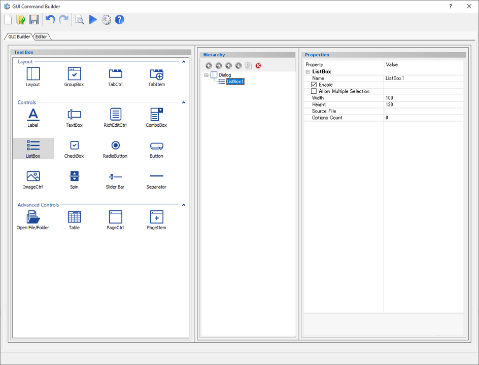
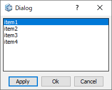
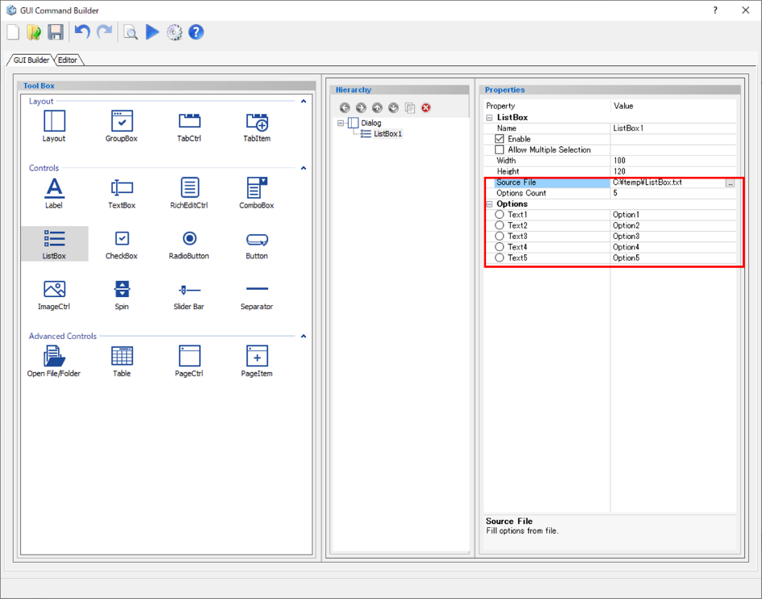

# List Box

Create a list box.  

  
  

Preview dialog:

  
  
## Parameters

**Name**

Enter the name of the combo box component.

**Enable**

Specify whether to enable it or not.

- **Check On** : Available
- **Check Off** : Unavailable (grayed out)

**Allow Multiple Selection**

Multiple options (items in the list box component) can be selected.

- **Check On** : Allowed
- **Check Off** : Not allowed

**Width**

Specify the minimum width of the combo box. (in pixels)

**Height**

Specify the minimum height of the combo box. (in pixels)

**Source File**

Import options from a text file.

Structure of the Source File:

 Option1  
 Option2  
 Option3  
 Option4  
 Option5  
  ↓  
 Input result:

  
  

**Option Count**

Specify the number of selection options.

**Options**

Enter name of the option in the list box.

## Command to use

| Command       | Description      | Sample Code      |
| ----------------------------------------------------------- | ------------------------------------------------------------ | ------------------------------------------------------------ |
| dlg.get_listbox_sel("name")    | Get the position of the selected item in the list box  | listbox  = ["1", "2", "3", "4", "5"] When "4" is selected *Input:* `a = a = dlg.get_listbox_sel("listbox")` *Output:*  > a = 3 |
| dlg.get_len_listbox("name")    | Get the length (number of items) of the list box  | listbox = ["1", "2", "3", "4", "5"] *Input:* `a = dlg.get_len_listbox("listbox")` *Output:*  > a = 5 |
| dlg.set_listbox_sel("Name", Index)     | Set the current selected option in the list box  | listbox = ["1", "2", "3", "4", "5"] *Input:* `dlg.set_listbox_sel("listbox", 3)` *Output:*  Selected value="4"|
| dlg.insert_listbox_option("name", position, "text")    | Add one option to a specific position in the list box  | *Input:* `dlg.insert_listbox_option("name", 1, "text")`|
| dlg.insert_listbox_options("name", position, [item list])     | Add multiple options to a specific position in the list box  | *Input:* `dlg.insert_listbox_options("name", 3, [item list])`|
