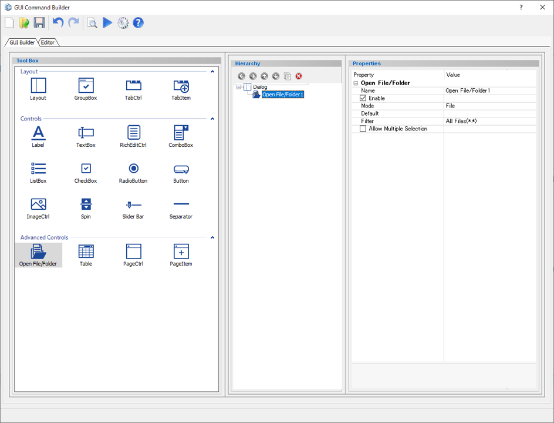
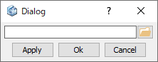

# Open File/Folder

Create a open file/folder selection.  

  
  
Preview dialog:

  
  
## Parameters

**Name**

Enter the Open File/Folder component name.

**Enable**

Specify whether to enable it or not.

- **Check On** : Available
- **Check Off** : Unavailable (grayed out)

**Mode**

Specify the selection mode.

- **File** : Only the file type can be selected.
- **Folder** : Only the Folder type can be selected.

**Default**

The default value (File/Folder) link to display.

**Filter**

Enter the File type user can select.

Filter format:

 Description 1 (Extension 1, Extension 2, ...), Description 2 (Extension 1, Extension 2, ...), ...

**Allow Multiple Selection**

Choose if multiple files can be selected or not.

- **Check On** : Allowed
- **Check Off** : Not allowed
