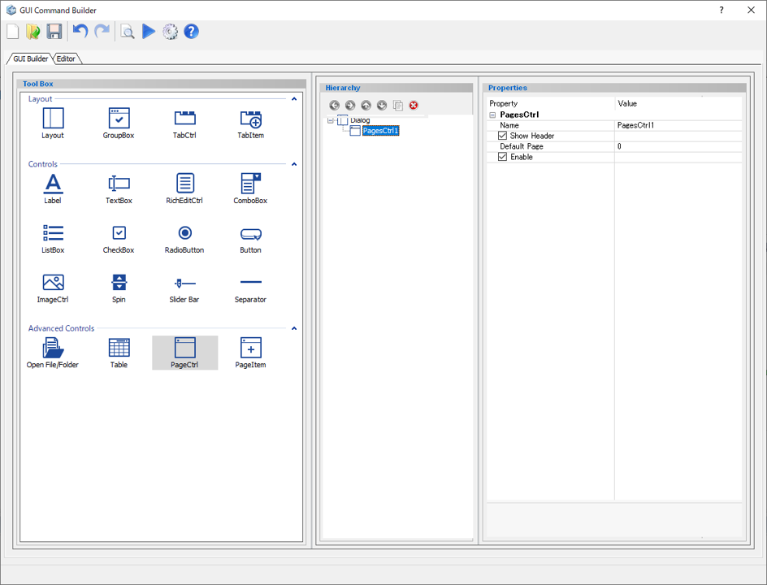
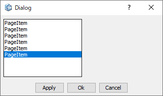

# Page Control

Create a page container (used for wizard).  

  
  
Preview dialog:

  

 ※Page Control is used as a container for Page Items.

## Parameters

**Name**

Enter the name of the Page Control component.

**Show Header**

Display the Header text of the Page Items or not.

- **Check On** : Display the header.
- **Check Off** : Do not display the header.

**Default Page**

Specify the Page item to be displayed by default.  
※ The number starts from zero.

**Enable**

Specify whether to enable it or not.

- **Check On** : Available
- **Check Off** : Unavailable (grayed out)
