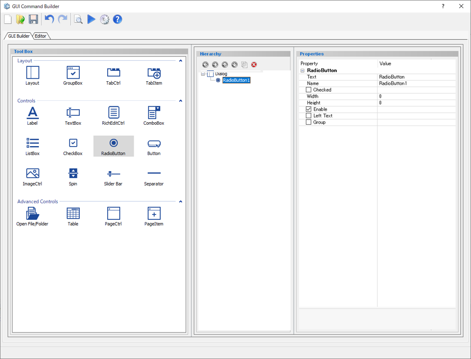
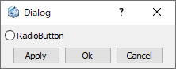

# Radio Button

Create a radio button.  

  
  
Preview dialog:

  
  
## Parameters

**Text**

Enter the text appears next to the radio button.

**Name**

Enter the name of the Radio Button component.

**Checked**

Specify the default status.

- **True** : Check On
- **False** : Check Off

**Width**

Specify the minimum width of the radio button. (in pixels)

**Height**

Specify the minimum height of the radio button. (in pixels)

**Enable**

Specify whether to enable it or not.

- **Check On** : Available
- **Check Off** : Unavailable (grayed out)

**Left text**

Display the text on the left side of the radio button.

- **Check On** : Text will be on the left side
- **Check Off** : Text will be on the default (right) side

**Group**

The below Radio Button components in the Hierarchy window will be in the same group.

## Command to use

| Command                   | Description                  | Sample Code                  |
| ----------------------------------------------------------- | ------------------------------------------------------------ | ------------------------------------------------------------ |
| dlg.isbutton_checked("component name")         | Check whether the radio button is checked or not   Return a Boolean value (`True`/`False`) | *Input:* `dlg.isbutton_checked("CheckBoxButton")`  |
| dlg.set_radiobutton_state("name", Bool)        | Specify the radio button status (checked or unchecked) | *Input:* `dlg.set_radiobutton_state("CheckBox1", True)`  |
