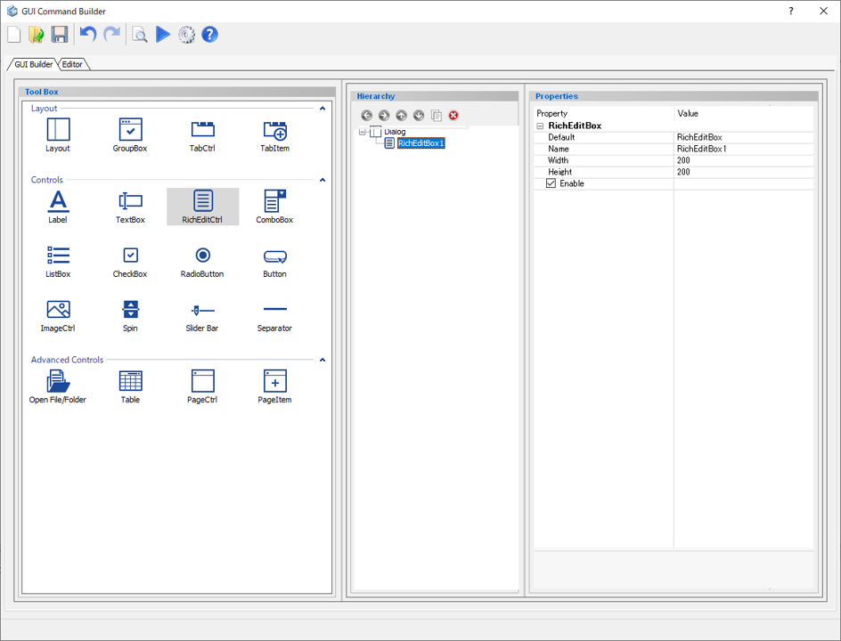
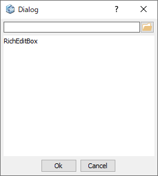

# Rich Edit Control

Create a text box that can be entered in various data formats and multiple lines.  

  
  
Preview dialog:

  
  
## Parameters

**Default**

Enter the text that is displayed by default.

**Name**

Enter the name of the rich edit control component.

**Width**

Specify the minimum width of the rich edit control component. (in pixels)

**Height**

Specify the minimum height of the rich edit control component. (in pixels)

**Enable**

Specify whether to enable it or not.

- **Check On** : Available
- **Check Off** : Unavailable (grayed out)
