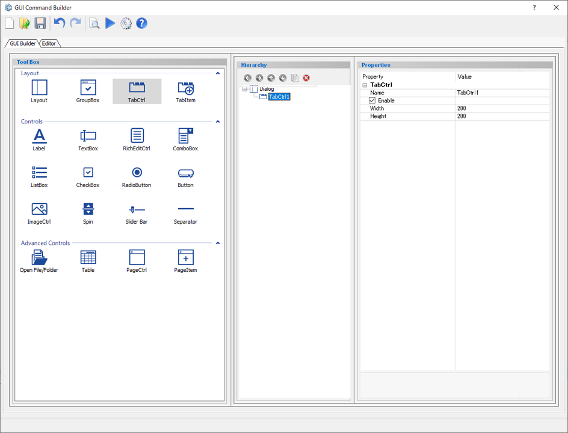
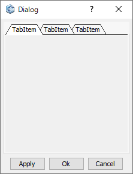

# Tab Control

Create a tab container  

  
  
Preview dialog:

  

 ※Tab Control is used to store Tab Items.

## Parameters

**Name**

Enter the name of the Tab Control component.

**Enable**

Specify whether to enable it or not.

- **Check On** : Available
- **Check Off** : Unavailable (grayed out)

**Width**

Specify the minimum width of the Tab Control. (in pixels)

**Height**

Specify the minimum height of the Tab Control. (in pixels)
