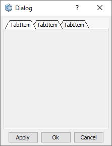

# Tab Item

Create a tab inside the tab container.  

  
  
Preview dialog:

  

 ※Tab Item is created inside Tab Control.

## Parameters

**Name**

Enter the name of the Tab Item component.

**Text**

Enter the header of the tab.

**Orientation**

Specify the position of tab items.

- **Horizontal** : Arrange the tab items horizontally
- **Vertical** : Arrange the tab items vertically
