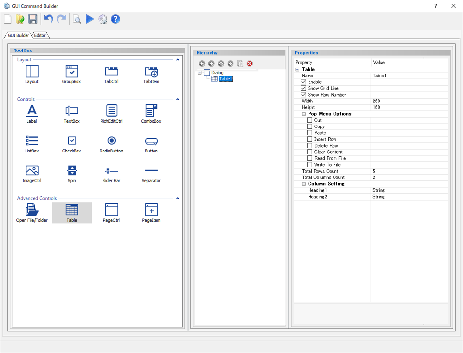
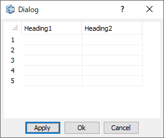

# Table

Create a table.  

  
  
Preview dialog:

  
  
## Parameters

**Name**

Enter the name of the Table component.

**Enable**

Specify whether to enable it or not.

- **Check On** : Available
- **Check Off** : Unavailable (grayed out)

**Show Grid Line**

Display of the grid line or not.

- **Check On** : Display the grid lines
- **Check Off** : Do not display the grid lines

**Show Row Number**

Display of the row number or not.

- **Check On** : Display the row number
- **Check Off** : Do not display the row number

**Width**

Specifies the minimum width of the table. (in pixels)

**Height**

Specifies the minimum height of the table. (in pixels)

**Pop Menu Options**

Display the right click menu.

Supported Options:  
Cut, Copy, Paste, Insert Row, Delete Row, Clear Content, Read From File, Write To File

**Total Rows Count**

Specify the number of rows.

**Total Columns Count**

Specify the number of columns.

**Column Setting**

Specify the type of the column.  
Heading*：Specify the content type of column.

## Command to use

| Command                   | Description                  | Sample Code                  |
| ----------------------------------------------------------- | ------------------------------------------------------------ | ------------------------------------------------------------ |
| dlg.set_cell_value("table name", "(cell_row_id, cell_column_id)", "value")          | Set the value to the specified cell  | *Input:* `dlg.set_cell_value("table name", "(1, 1)", "value")`  |
| dlg.get_cell_value("table name", "(cell_row_id, cell_column_id)")         | Get the value of the specified cell  | *Input:* `dlg.get_cell_value("table name", "(1,1)")`  |
| dlg.get_total_row("table name")         | Get the total number of rows in the table  | *Input:* `dlg.get_total_row("table name")`  |
| dlg.get_total_column("table name")         | Get the total number of columns in the table  | *Input:* `dlg.get_total_column("table name")`  |
