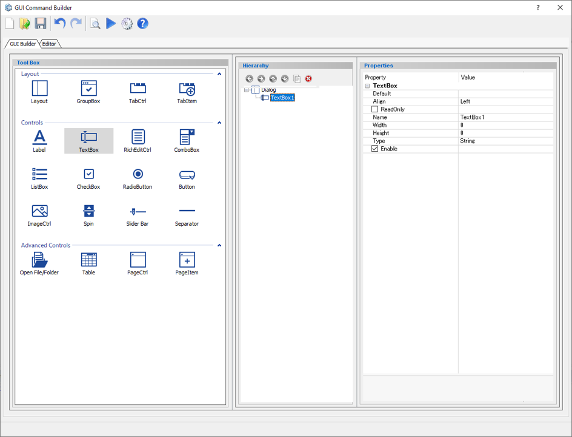
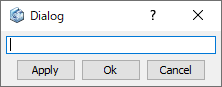

# Text Box

Create a text box.  

  
  
Preview dialog:

  
  
## Parameters

**Default**

Enter the text that is displayed by default.

**Align**

Specify the display position of the text inside the box.

- **Left** : Left alignment
- **Right** : Right align
- **Center** : Center align

**ReadOnly**

- **Check On** : Text cannot be edited. (copying is possible.)
- **Check Off** : Text can be edited.

**Name**

Enter the name of the text box component.

**Width**

Specify the minimum width of the text box. (in pixels)

**Height**

Specify minimum height of the text box. (in pixels)

**Type**

Specify the data type that can be entered into the text box (for validation).

- **String** : string type
- **Double** : double precision floating point number type
- **Integer** : integer type

**Enable**

Specify whether to enable it or not.

- **Check On** : Available
- **Check Off** : Unavailable (grayed out)

## Command to use

| Command                   | Description                  | Sample Code                  |
| ----------------------------------------------------------- | ------------------------------------------------------------ | ------------------------------------------------------------ |
| dlg.set_item_text("component name","text")          | Set the text displayed in the text box  | *Input:* `dlg.set_item_text("Item", "text")`  |
| dlg.get_item_text("component name")         | Get the text displayed in the text box  | *Input:* `dlg.get_item_text("TextBox")`  |
