# GUI Command Builder

GUI Command Builder is an interactive builder of PSJ-GUI, help making Jupiter dialog or wizard by drag and drop operations. User hence does not need to know Python programming language to make UI components in Jupiter.

## Tool Menu

Perform operations related to the creation of dialogs and wizards.


|                               Icon                               | Name                             | Description                                                          |           Shortcut Key            |
| :--------------------------------------------------------------: | :------------------------------- | :------------------------------------------------------------------- | :-------------------------------: |
|                   | Make a new dialog                | Clear the being created settings and open a new environment          | {badge}`F5,badge-dark badge-pill` |
|                 | Open an existing database        | Open and load a database file                                        | {badge}`F4,badge-dark badge-pill` |
|                 | Save dialog settings to database | Save the being created dialoge settings to an external database file | {badge}`F6,badge-dark badge-pill` |
|                 | Undo                             | Click this icon to undo the previously executed operation            |                                   |
|                 | Redo                             | Click this icon to redo the previously cancelled operation           |                                   |
|  | Show or hide code window         | Switch showing or hiding the code window                             | {badge}`F1,badge-dark badge-pill` |
|           | Preview dialog                   | Display a preview of the being created dialog                        | {badge}`F2,badge-dark badge-pill` |
|       | Integrate                        | Save dialog to customer folder and display it in Jupiter's ribbon    | {badge}`F3,badge-dark badge-pill` |
|                 | Help                             | Display a short tutorial (being created)                             |                                   |

## Tool Box Window

Contain all the components used to create dialogs and wizards.

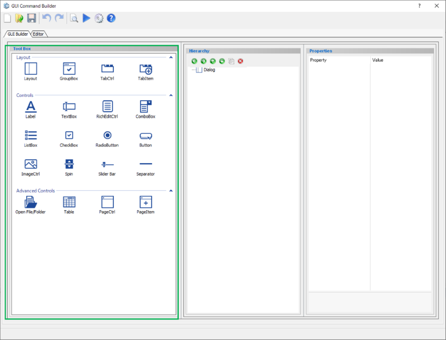

|                                   Icon                                   | Name              | Description                                                                      |
| :----------------------------------------------------------------------: | :---------------- | :------------------------------------------------------------------------------- |
|           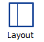           | Layout            | Create a layout to arrange components inside                                     |
|        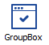         | Group Box         | Create a group box which can contain some components                             |
|      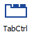       | Tab Control       | Create a tab container                                                           |
|            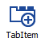            | Tab Item          | Create a tab inside the tab container                                            |
|            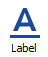            | Label             | Create a label                                                                   |
|         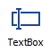          | Text Box          | Create a text box                                                                |
| 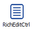 | Rich Edit Control | Create a text box that can be entered in various data formats and multiple lines |
|        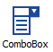         | Combo Box         | Create a combo box                                                               |
|                   | List Box          | Create a list box                                                                |
|        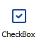         | Check Box         | Create a check box                                                               |
|     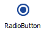      | Radio Button      | Create a radio button                                                            |
|           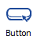           | Button            | Create a button                                                                  |
|    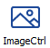     | Image Control     | Create an image container                                                        |
|             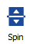             | Spin              | Create a spin button                                                             |
|       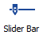        | Slider Bar        | Create a slide bar                                                               |
|        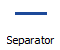        | Separator         | Create a separator line                                                          |
|  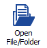  | Open File/Folder  | Create a open file/folder selection                                              |
|            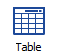            | Table             | Create a table                                                                   |
|     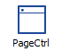      | Page Control      | Create a page container (used for wizard)                                        |
|        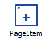         | Page Item         | Create a page inside the page container (used for wizard)                        |

Below is the detail properties for each component:

```{toctree}
:maxdepth: 1
:hidden:

component/index
```

## Hierrachy Window

All components in use are displayed in a tree format.
User can change the position, duplicate or delete components.

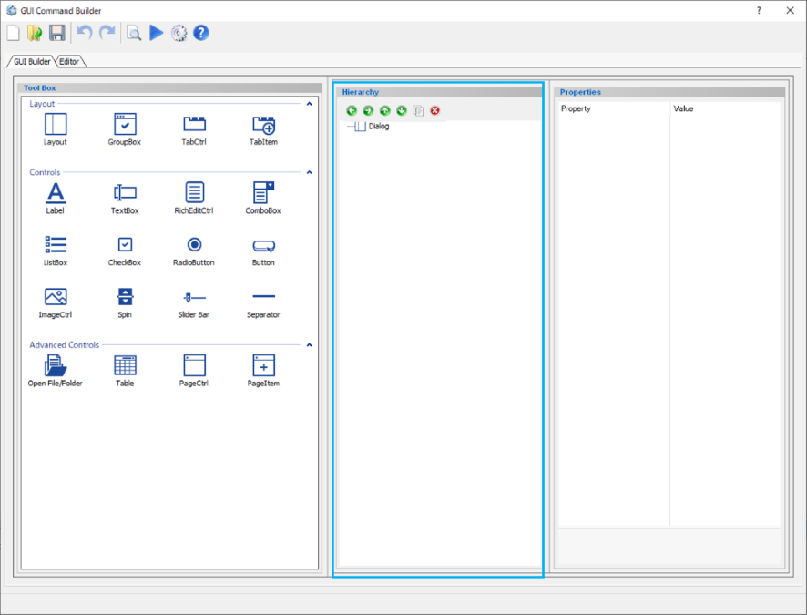

|                                 Icon                                 | Name                               | Description                                                                          |
| :------------------------------------------------------------------: | :--------------------------------- | ------------------------------------------------------------------------------------ |
|     | Move item out of current container | Move the selected component out of the current container which it is being belong to |
|    | Move item into next container      | Move the selected component into the above container                                 |
|    | Move item forward one level        | Move the selected component up one level but still inside the current container      |
|  | Move item backward one level       | Move the selected component down one level but still inside the current container    |
|      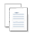       | Copy item and insert it            | Duplicate the selected component                                                     |
|                | Delete selected item               | Delete the selected component                                                        |

## Properties Window

Display all properties of the selected component.
The settings of the dialog created can also be set from the Properties window.
By selecting a component in the Hierarchy window, user can change its parameters in this Properties window.

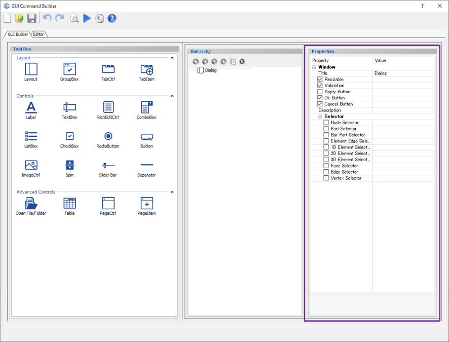
