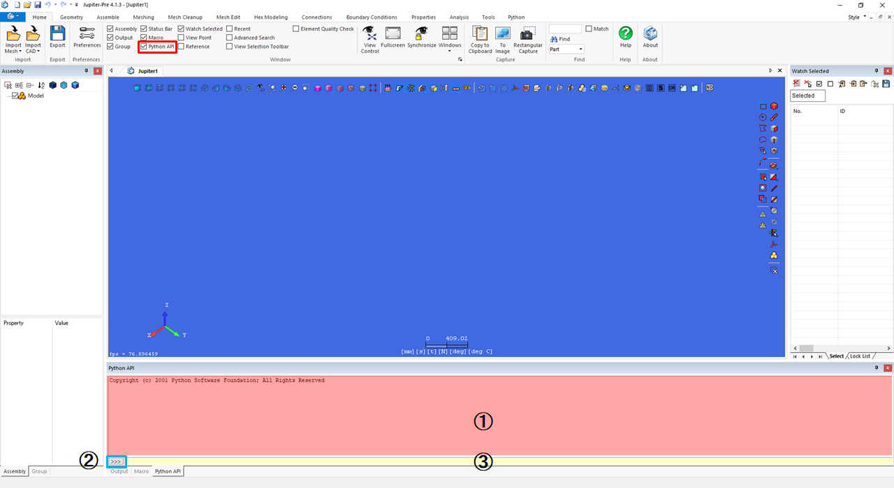
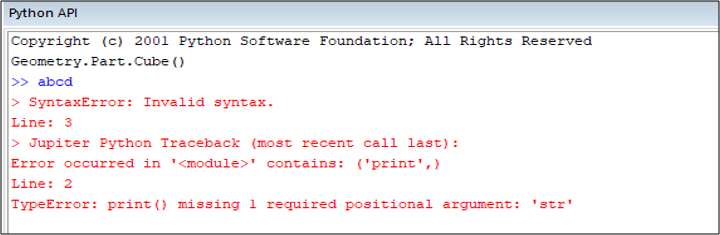
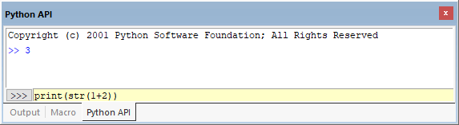

# Python API Window

## Interface
How to display the Python API window: Check the checkbox for the Python API in "Home > Window > Python API" to display the Python API window.

  
  

### ① Python API Window
Python commands and execution results are displayed.

- Black: PSJ-command information.  
- Blue: Script execution result.  
- Red: Error message.  

### ② IDE launcher button 
Launch the Python IDE.

### ③ Edit Box

User can run Python scripts directly from the Python API window.  
Command input is possible by copy and paste.  
