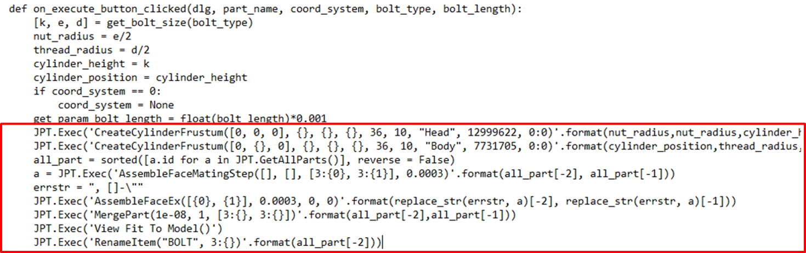

# Creating a standard bolt

This tutorial demonstrates how to make a custom bolt using a pre-defined template by using Jupiter macro. Finally, it will integrates the macro to a custom UI using GUI Command Builder.

```{admonition} New topic covered
:class: note

1. Understand how to get and make use of Jupiter macro

2. Implement the Jupiter macro to a general Python script for automatic process

3. Create a dialogue using GUI Command Builder

4. Intergrate the user's script in (2.) to the dialogue made in (3.) to make a custom UI function

5. Add the custom UI function to Jupiter's ribbon and start using it
```

## Overview

In this tutorial, user will make a UI dialoge to embed the Jupiter's customized Python macro for automatic work.

After user selects the bolt's size and press Apply or OK button (left figure), a user-standard bolt will be made and show in Jupiter's screen (right figure).

```{figure} ./../_images/Tutorial/creating_bolt/purpose_target.png
:alt: Purpose and Target
:width: 600px
:align: center
:name: purpose-and-target

Purpose and Target
```

## Procedure

1. **Get Macro**: Run Jupiter available functions to get the respective Macro

2. **Create def function in Python**: Combine Macro with Python based script in order to create a full user function

3. **Create User Interface (UI)**: Use GUI Command Builder to make a UI dialogue connecting to the user function

4. **Implement**: Register the new UI dialogue to Jupiter software

### Get Macro

#### Creating 2 cylinders

Using `Geometry > Create Entity > Part > Cylinder` function to make 2 cylinders in sequence: one for bolt head, another for bolt body.

```{figure} ./../_images/Tutorial/creating_bolt/Get_macro.png
:alt: Make 2 cylinders
:width: 680px
:align: center
:name: make-2-cylinders

Make 2 cylinders
```

User then can see the bolt created in Jupiter's screen:

```{figure} ./../_images/Tutorial/creating_bolt/output1.png
:alt: Get Macro
:align: center
:name: get-macro

Get macro
```

as well as the corresponded macro in Macro window:

```python
CreateCylinderFrustum([0, 0, 0], 0.003, 0.003, 0.002, 36, 10, "Head", 12999622, 0:0)
CreateCylinderFrustum([0, 0.002, 0], 0.0015, 0.0015, 0.01, 36, 10, "Body", 7731705, 0:0)
```

#### Creating assemble face

Then, using `Assemble > Assemble > Assemble Faces` to make to cylinder share one same face (this would help mesh continue between 2 parts).

```{figure} ./../_images/Tutorial/creating_bolt/assemble.png
:alt: Assemble
:align: center
:name: assemble

Assemble
```

A corresponded macro in Macro window will be generated:

```python
AssembleFaceMatingStep([], [], [3:1, 3:2], 0.0003)
```

#### Merging 2 parts

Next, using `Geometry > Edit Entity > Merge Entities > Parts` to merge 2 cylinders into 1 body. This part will be considered as a simple bolt geometry used in this tutorial.

```{figure} ./../_images/Tutorial/creating_bolt/merge2parts.png
:alt: Merge 2 parts
:align: center
:name: merge-2-parts

Merge 2 parts
```

A corresponded macro in Macro window will be generated:

```python
MergePart(1e-08, 1, [3:2, 3:1])
```

#### Renaming part

Finally, right click on the part in Assembly window to rename this part to **BOLT**.

```{figure} ./../_images/Tutorial/creating_bolt/rename_part.png
:alt: Rename the bolt
:align: center
:name: rename-bolt

Rename the bolt
```

A corresponded macro in Macro window will be generated:

**Macro output**

```python
RenameItem("BOLT", 3:2)
```

### Create DEF function in Python

To recap, below is the total macro collected in the above steps:

```{code-block} python
---
lineno-start: 1
caption: Macro used in this tutorial
---
CreateCylinderFrustum([0, 0, 0], 0.003, 0.003, 0.002, 36, 10, "Head", 12999622, 0:0)
CreateCylinderFrustum([0, 0.002, 0], 0.0015, 0.0015, 0.01, 36, 10, "Body", 7731705, 0:0)
AssembleFaceMatingStep([], [], [3:1, 3:2], 0.0003)
MergePart(1e-08, 1, [3:2, 3:1])
RenameItem("BOLT", 3:2)
```

- To execute the code into Python, use the format of `JPT.Exec(“Macro”)`

- Using the above script, now parameterize the numbers and add some built-in Python functions (if…else, for, while, etc.) to make the script adapt to different input parameters.

In this sample, the def function `<on_execute_button_clicked()>` is responsible for implementing the OK or Apply button.

```python
def on_execute_button_clicked(dlg, part_name, coord_system, bolt_type, bolt_length):
```

```{admonition} Note
:class: note
The Macro is added to create the bolt according to the value generated by user. From now, user can combine the knowledge about Python language and just generated Macro to create def function
```



```{seealso} Further informaiton
For further information on creating the def function in Python, please refer to the comments in the sample code
**Sample code**: `CreateBolt.py`
```

### Create User Interface (UI)


Open GUI Command Builder: `Python ribbon > Python Script in Jupiter > GUI Command Builder`
